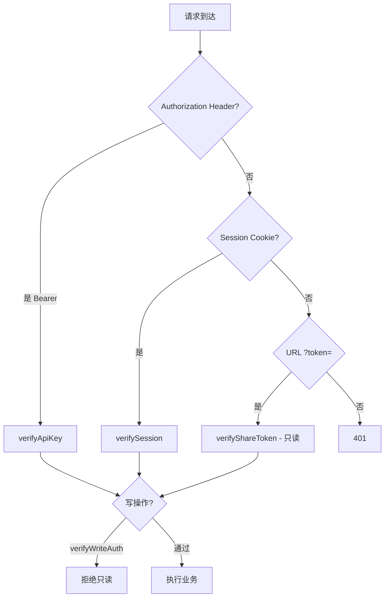
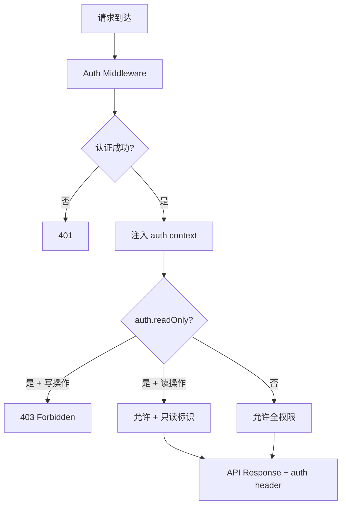
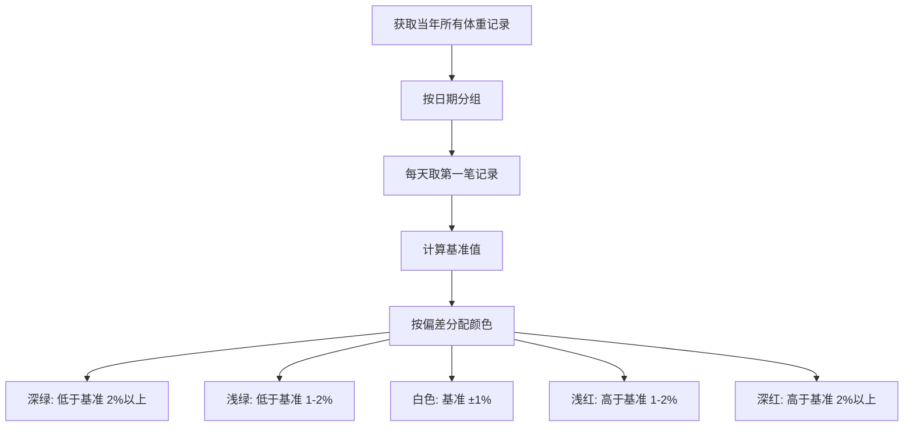
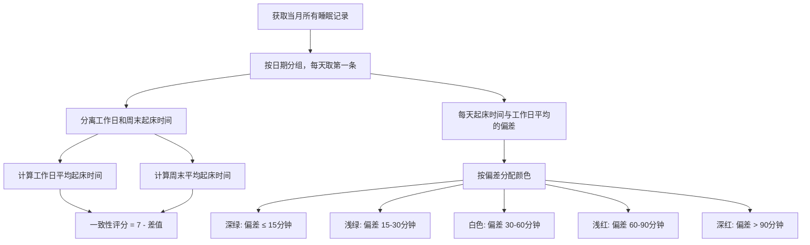

# 大修复版本 — 修复计划与实施方案

> 版本：v0.2.0-fix  
> 状态：规划中  
> 基于：[项目全面分析报告] 及 [flx.md] 已知问题

---

## 目录

1. [概览](#概览)
2. [P1 — 安全加固](#p1--安全加固)
3. [P2 — 统一认证系统重构](#p2--统一认证系统重构)
4. [P3 — 只读模式 UI 增强](#p3--只读模式-ui-增强)
5. [P4 — 代码重构](#p4--代码重构)
6. [P5 — 性能优化](#p5--性能优化)
7. [P6 — 数据库优化](#p6--数据库优化)
8. [P7 — 体重日力图增强](#p7--体重日力图增强)
9. [P8 — 睡眠一致性评分与日历图](#p8--睡眠一致性评分与日历图)
10. [测试补充计划](#测试补充计划)
11. [影响范围总览](#影响范围总览)

---

## 概览

### 修复范围

| 优先级 | 类别 | 涉及文件数 | 预估工时 |
|--------|------|-----------|---------|
| P1 | 安全加固 | 8 | 4h |
| P2 | 统一认证系统重构 | 10 | 6h |
| P3 | 只读模式 UI 增强 | 8 | 4h |
| P4 | 代码重构 | 12 | 6h |
| P5 | 性能优化 | 6 | 4h |
| P6 | 数据库优化 | 2 | 2h |
| P7 | 体重日力图增强 | 2 | 2h |
| P8 | 睡眠一致性评分与日历图 | 5 | 4h |
| — | 测试补充 | 8+ | 8h |

### 当前测试覆盖率

```
CLI 功能覆盖率:  ~15%（仅 record + auth login + config set + timeline）
API 路由覆盖率:   0%（无任何 API 测试）
前端页面覆盖率:   0%（无前端测试）
负面测试覆盖率:   0%（无错误场景测试）
────────────────────────────────
综合覆盖率:      < 5%
```

---

## P1 — 安全加固

### P1-1 Device Code 端点添加认证保护

**问题**：`GET /api/v1/auth/device` 无认证即可列出所有用户的 device codes，严重信息泄露。

**涉及文件**：`packages/web/app/api/v1/auth/device/route.ts`

**修复方案**：
1. `GET` 方法改为需要认证，且仅返回当前用户的 device codes
2. 或如果 GET 仅用于内部调试，直接移除该 handler

```typescript
// GET 改为仅返回当前用户的 device codes
export async function GET(req: NextRequest) {
  const auth = await verifyAuth(req)
  if (!auth) {
    return NextResponse.json({ error: 'Unauthorized' }, { status: 401 })
  }
  const codes = await prisma.deviceCode.findMany({
    where: { userId: auth.userId },
    select: { deviceCode: true, status: true, expiresAt: true }
  })
  return NextResponse.json({ codes })
}
```

---

### P1-2 API Key 改为哈希存储

**问题**：API Key 以明文存储在数据库中，数据库泄露即暴露所有 Key。且 Key 由 `randomUUID().replace(/-/g, '')` 生成，无前缀区分。

**涉及文件**：
- `packages/web/app/api/v1/api-keys/route.ts` — 创建 Key
- `packages/web/app/api/v1/api-keys/[id]/route.ts` — 删除 Key
- `packages/web/lib/auth.ts` — 验证 Key

**修复方案**：

1. 生成 Key 时使用 `crypto.randomBytes(32).toString('hex')` + `hum_` 前缀
2. 存储时使用 `bcryptjs.hash(key, 10)`
3. 验证时使用 `bcryptjs.compare(key, storedHash)`
4. 创建时返回原始 Key 给用户（仅此一次），提示用户保存

```typescript
// 创建 API Key
import { randomBytes } from 'crypto'
import bcrypt from 'bcryptjs'

const rawKey = `hum_${randomBytes(32).toString('hex')}`
const hashedKey = await bcrypt.hash(rawKey, 10)

// 存储 hashedKey
await prisma.apiKey.create({
  data: {
    key: hashedKey,
    name,
    userId: auth.userId
  }
})

// 返回原始 Key（仅此一次）
return NextResponse.json({ key: rawKey, name, id: created.id })
```

```typescript
// 验证 API Key（lib/auth.ts）
async function verifyApiKey(req: NextRequest) {
  const header = req.headers.get('authorization')
  if (!header?.startsWith('Bearer ')) return null
  const rawKey = header.slice(7)

  // 查找所有 key 并逐一比较（无法用 findUnique）
  const keys = await prisma.apiKey.findMany({
    where: { deleteAt: 0 },
    include: { user: true }
  })

  for (const key of keys) {
    if (await bcrypt.compare(rawKey, key.key)) {
      await prisma.apiKey.update({
        where: { id: key.id },
        data: { lastUsed: Math.floor(Date.now() / 1000) }
      })
      return { userId: key.userId, type: 'apiKey' as const }
    }
  }

  return null
}
```

> **性能注意**：API Key 验证变成 O(n) 需遍历所有 Key。如 Key 数量很大，可考虑在 Key 前保留短前缀做索引（如 `hum_abc123_<random>`，取前 N 位建索引）。

---

### P1-3 登录/注册添加速率限制

**问题**：登录无限次尝试，注册无频率限制，可被暴力攻击。

**涉及文件**：
- `packages/web/app/api/auth/register/route.ts`
- `packages/web/auth.ts` — authorize 函数

**修复方案**：添加基于 IP 的内存速率限制器

```typescript
// packages/web/lib/rate-limiter.ts
const attempts = new Map<string, { count: number; resetAt: number }>()

export function rateLimit(ip: string, maxAttempts: number, windowMs: number) {
  const now = Date.now()
  const entry = attempts.get(ip)

  if (!entry || now > entry.resetAt) {
    attempts.set(ip, { count: 1, resetAt: now + windowMs })
    return true
  }

  if (entry.count >= maxAttempts) {
    return false
  }

  entry.count++
  return true
}
```

**配置**：
- 登录：5 次/分钟/IP
- 注册：3 次/小时/IP
- 通用 API：100 次/分钟/用户

---

### P1-4 CLI 安全改进

**问题**：
- `--api-key` 参数出现在 shell history 中
- `config list` 输出包含 token 等敏感信息
- API 默认 HTTP 明文连接

**涉及文件**：
- `packages/cli/src/commands/auth.js`
- `packages/cli/src/commands/config.js`
- `packages/cli/src/lib/api.js`

**修复方案**：

1. **API Key 从环境变量读取**：
```javascript
// auth.js
.option('--api-key <key>', 'API Key（也可通过 HUM_API_KEY 环境变量设置）')
.action(async (options) => {
  const key = options.apiKey || process.env.HUM_API_KEY
  // ...
})
```

2. **config list 脱敏**：
```javascript
// config.js
function maskSensitive(key, value) {
  const sensitiveKeys = ['apiKey', 'accessToken', 'refreshToken']
  if (sensitiveKeys.includes(key) && value) {
    return value.slice(0, 4) + '****' + value.slice(-4)
  }
  return value
}
```

3. **默认 API 地址警告**：当 apiUrl 为 `http://localhost:3000` 时输出黄色警告，建议生产环境使用 HTTPS。

---

### P1-5 文件路由认证扩展 + 归属校验

**问题**：文件下载仅支持 API Key 认证（非 `verifyAuth`），Session 用户无法访问自己的文件。且无文件归属校验。

**涉及文件**：`packages/web/app/api/v1/files/[type]/[filename]/route.ts`

**修复方案**：
1. 改用 `verifyAuth`（支持三合一认证）
2. 增加文件归属校验（通过 Prisma 查询该文件是否属于当前用户的某条记录）

```typescript
export async function GET(req: NextRequest, { params }) {
  const auth = await verifyAuth(req)
  if (!auth) {
    return NextResponse.json({ error: 'Unauthorized' }, { status: 401 })
  }

  // 校验文件归属
  const attachmentOwner = await prisma.record.findFirst({
    where: {
      userId: auth.userId,
      attachments: { contains: params.filename }
    }
  })
  // 同时检查 Weight/Diet/Exercise 等实体的附件
  // ...（省略具体实现）
  if (!attachmentOwner) {
    return NextResponse.json({ error: 'Not found' }, { status: 404 })
  }

  // 原有文件读取逻辑...
}
```

---

## P2 — 统一认证系统重构

### 当前状态



**现有问题**：
1. 认证逻辑分散在 `lib/auth.ts` 中的多个函数
2. 每个路由手动调用 `verifyAuth` + `verifyWriteAuth`
3. Share Token 通过 URL query 传递（不安全 + 不可扩展）
4. 文件路由独立使用 `verifyApiKey`，绕过统一认证
5. 只读权限信息未暴露给前端 UI 层

---

### 目标架构



---

### P2-1 统一 `authContext` 类型定义

**文件**：`packages/web/lib/auth.ts`（新增/重写）

```typescript
export interface AuthContext {
  userId: string
  type: 'apiKey' | 'session' | 'shareToken'
  readOnly: boolean        // 是否只读
  source: 'header' | 'cookie' | 'param'
  tokenId?: string          // API Key ID 或 Share Token ID
}

export type AuthResult = AuthContext | null
```

---

### P2-2 统一 `getAuth` 中间件

**文件**：`packages/web/lib/auth.ts`

```typescript
import { auth } from '@/auth'
import { prisma } from '@/lib/prisma'
import bcrypt from 'bcryptjs'
import type { NextRequest } from 'next/server'

/**
 * 统一认证入口
 * 按优先级尝试：API Key → Session → Share Token
 * 返回 AuthContext 包含 readOnly 标记
 */
export async function getAuth(req: NextRequest): Promise<AuthResult> {
  // 1. API Key 认证（Authorization: Bearer <key>）
  const header = req.headers.get('authorization')
  if (header?.startsWith('Bearer ')) {
    const rawKey = header.slice(7)
    const keys = await prisma.apiKey.findMany({
      where: { deleteAt: 0 },
      include: { user: true }
    })
    for (const key of keys) {
      if (await bcrypt.compare(rawKey, key.key)) {
        await prisma.apiKey.update({
          where: { id: key.id },
          data: { lastUsed: Math.floor(Date.now() / 1000) }
        })
        return {
          userId: key.userId,
          type: 'apiKey',
          readOnly: false,
          source: 'header',
          tokenId: key.id
        }
      }
    }
  }

  // 2. Session 认证
  const session = await auth()
  if (session?.user?.id) {
    return {
      userId: session.user.id,
      type: 'session',
      readOnly: false,
      source: 'cookie'
    }
  }

  // 3. Share Token 认证
  const url = new URL(req.url)
  const shareToken = url.searchParams.get('token')
    || req.headers.get('x-share-token')
  if (shareToken?.startsWith('share_')) {
    const token = await prisma.shareToken.findFirst({
      where: { token: shareToken, enabled: true }
    })
    if (token) {
      // 记录访问日志
      await prisma.viewLog.create({
        data: {
          shareTokenId: token.id,
          ip: req.headers.get('x-forwarded-for') || 'unknown',
          userAgent: req.headers.get('user-agent') || 'unknown'
        }
      })
      return {
        userId: token.ownerId,
        type: 'shareToken',
        readOnly: true,      // 只读
        source: 'param',
        tokenId: token.id
      }
    }
  }

  return null
}

/**
 * 要求写权限（拒绝只读 token）
 */
export function requireWriteAuth(auth: AuthResult): AuthResult {
  if (!auth) return null
  if (auth.readOnly) return null
  return auth
}
```

---

### P2-3 Share Token 从 Header 读取

**变更**：
1. 支持从 `x-share-token` header 读取（**推荐方式**）
2. 保留 URL `?token=` 兼容（标记为 deprecated）
3. 前端 Middleware 注入 header

**文件**：`packages/web/middleware.ts`

```typescript
import { NextResponse } from 'next/server'
import type { NextRequest } from 'next/server'

export function middleware(req: NextRequest) {
  const token = req.nextUrl.searchParams.get('token')
  if (token) {
    const headers = new Headers(req.headers)
    headers.set('x-share-token', token)

    // 清除 URL 中的 token
    const url = req.nextUrl.clone()
    url.searchParams.delete('token')

    return NextResponse.rewrite(url, { request: { headers } })
  }
}
```

---

### P2-4 所有 API 路由切换到 `getAuth`

**涉及文件**（全部 API 路由文件）：

| 路由文件 | 当前调用 | 改为 |
|---------|---------|------|
| `api/v1/weights/route.ts` | `verifyAuth` / `verifyWriteAuth` | `getAuth` / `requireWriteAuth` |
| `api/v1/exercises/route.ts` | 同上 | 同上 |
| `api/v1/diets/route.ts` | 同上 | 同上 |
| `api/v1/sleeps/route.ts` | 同上 | 同上 |
| `api/v1/records/route.ts` | 同上 | 同上 |
| `api/v1/timeline/route.ts` | 同上 | 同上 |
| `api/v1/settings/route.ts` | 同上 | 同上 |
| `api/v1/files/[type]/[filename]/route.ts` | `verifyApiKey` | `getAuth` |
| `api/v1/api-keys/route.ts` | `verifyAuth` | `getAuth`（仅 Session 类型） |
| `api/v1/share/route.ts` | `verifyAuth` | `getAuth`（仅 Session 类型） |
| `api/v1/auth/verify/route.ts` | `verifyApiKey` | `getAuth` |
| `api/v1/auth/device/route.ts` | 无认证 | `getAuth`（GET 需认证） |

**统一模式**：

```typescript
import { getAuth, requireWriteAuth } from '@/lib/auth'

// 读操作
export async function GET(req: NextRequest) {
  const auth = await getAuth(req)
  if (!auth) {
    return NextResponse.json({ error: 'Unauthorized' }, { status: 401 })
  }
  // 业务逻辑...
}

// 写操作
export async function POST(req: NextRequest) {
  const auth = await requireWriteAuth(await getAuth(req))
  if (!auth) {
    return NextResponse.json({ error: 'Forbidden' }, { status: 403 })
  }
  // 业务逻辑...
}
```

---

## P3 — 只读模式 UI 增强

### 当前状态

Share Token 访问时，前端通过 `ReadOnlyProvider` 获取只读状态，但存在以下问题：
1. 只读模式下仍然显示「添加」「编辑」「删除」等按钮
2. 没有明显的只读视觉标识
3. 没有只读水印

---

### P3-1 隐藏只读模式下的操作 UI

**涉及文件**：所有 Dashboard 页面组件

**规则**：
| 元素 | 只读模式行为 |
|------|------------|
| 添加按钮（如「+ 添加体重」） | 隐藏 |
| 编辑按钮 | 隐藏 |
| 删除按钮 | 隐藏 |
| 表单输入区 | 隐藏 |
| 详情查看（点击记录展开） | ✅ 显示 |
| 图表和统计 | ✅ 显示 |
| 列表 | ✅ 显示 |
| 导出按钮 | ✅ 显示 |

**实现方式**：在现有 `ReadOnlyProvider` 基础上，各组件通过 `useReadOnly()` hook 控制 UI 可见性。

```typescript
// 已有使用方式（确认存在）
const isReadOnly = useReadOnly()

// 在各页面中
{!isReadOnly && (
  <button onClick={handleAdd}>+ 添加体重</button>
)}
{!isReadOnly && (
  <button onClick={handleDelete}>删除</button>
)}
```

**需修改的文件**：
- `packages/web/app/dashboard/weight/page.tsx`
- `packages/web/app/dashboard/exercise/page.tsx`
- `packages/web/app/dashboard/diet/page.tsx`
- `packages/web/app/dashboard/sleep/page.tsx`
- `packages/web/app/dashboard/records/page.tsx`
- `packages/web/app/dashboard/api-keys/page.tsx`
- `packages/web/app/settings/page.tsx`

---

### P3-2 详情查看功能（只读模式下可查看详情）

**需求**：只读模式下不能编辑删除，但可以点击记录查看完整详情。

**现有问题**：部分页面可能将「查看详情」与「编辑」耦合在同一交互中。

**方案**：
1. 列表项点击 → 展开详情面板（纯展示，无表单）
2. 编辑模式 → 仅在非只读时可用

```typescript
// 列表项组件
function RecordItem({ record }) {
  const isReadOnly = useReadOnly()
  const [showDetail, setShowDetail] = useState(false)

  return (
    <div>
      <div onClick={() => setShowDetail(!showDetail)}>
        {record.title}
      </div>
      {showDetail && (
        <div className="detail-panel">
          {/* 只读详情展示 */}
          <p>体重：{record.weight}kg</p>
          <p>日期：{record.date}</p>
          <p>备注：{record.note}</p>
        </div>
      )}
      {!isReadOnly && (
        <button onClick={() => handleEdit(record)}>编辑</button>
      )}
    </div>
  )
}
```

---

### P3-3 只读水印

**需求**：在只读模式下，页面显示半透明水印「只读模式」。

**实现方式**：

1. **CSS 水印方案**（推荐，纯前端，实现简单）

```css
/* packages/web/app/globals.css */
.readonly-watermark {
  position: relative;
}

.readonly-watermark::after {
  content: '只读模式';
  position: fixed;
  top: 50%;
  left: 50%;
  transform: translate(-50%, -50%) rotate(-30deg);
  font-size: 120px;
  color: rgba(128, 128, 128, 0.08);
  pointer-events: none;
  z-index: 9999;
  white-space: nowrap;
  user-select: none;
}
```

2. **React 组件方案**（更灵活，可配置文字和样式）

```tsx
// packages/web/app/components/ReadOnlyWatermark.tsx
'use client'

import { useReadOnly } from '@/app/components/ReadOnlyProvider'

export function ReadOnlyWatermark() {
  const isReadOnly = useReadOnly()

  if (!isReadOnly) return null

  return (
    <div
      className="pointer-events-none fixed inset-0 z-50 flex items-center justify-center"
      aria-hidden="true"
    >
      <div
        className="select-none whitespace-nowrap text-[120px] font-bold text-gray-400/5 -rotate-30"
      >
        {t('readOnly')}
      </div>
    </div>
  )
}
```

3. **在 Layout 中引入**：

```tsx
// packages/web/app/layout.tsx
import { ReadOnlyWatermark } from '@/app/components/ReadOnlyWatermark'

export default function RootLayout({ children }) {
  return (
    <html>
      <body>
        <ReadOnlyProvider>
          {children}
          <ReadOnlyWatermark />
        </ReadOnlyProvider>
      </body>
    </html>
  )
}
```

---

## P4 — 代码重构

### P4-1 CLI 提取 CRUD 工厂函数

**问题**：`diet.js` / `exercise.js` / `sleep.js` / `weight.js` 四个模块高度模板化，24 个子命令大量重复代码。

**方案**：创建 `packages/cli/src/lib/crud-command.js`

```javascript
// packages/cli/src/lib/crud-command.js
import { Command } from 'commander'
import { request, createFormData } from './api.js'
import { outputData } from './output.js'
import { appendTimezoneOffset, buildQueryParams } from './timezone.js'

/**
 * 创建标准 CRUD 命令组
 * @param {string} name - 命令名称（如 'diet', 'weight'）
 * @param {object} options
 * @param {string} options.endpoint - API 端点前缀（如 '/v1/diets'）
 * @param {object} options.fields - 字段映射 { cliOpt: 'apiField' }
 * @param {string[]} options.fileFields - 支持文件上传的字段
 * @param {object} options.statsFormatter - 统计输出格式化函数
 */
export function createCrudCommand(name, options) {
  const cmd = new Command(name)
    .description(`${name} 记录管理`)

  // add — 添加记录
  cmd.command('add')
    .description(`添加${name}记录`)
    .option('--date <date>', '日期')
    // ... 动态添加字段选项
    .action(async (opts) => {
      try {
        const data = {}
        for (const [cliOpt, apiField] of Object.entries(options.fields)) {
          if (opts[cliOpt] !== undefined) data[apiField] = opts[cliOpt]
        }
        const formData = createFormData(data, opts.file || [])
        const result = await request('POST', options.endpoint, formData)
        outputData(result, { format: opts.format })
      } catch (e) {
        console.error(`添加${name}记录失败:`, e.message)
        process.exitCode = 1
      }
    })

  // list — 列出记录
  cmd.command('list')
    .description(`列出${name}记录`)
    // ...
    .action(async (opts) => {
      const params = buildQueryParams(opts)
      const result = await request('GET', `${options.endpoint}?${params}`)
      outputData(result, { format: opts.format, type: 'list' })
    })

  // get — 获取详情
  cmd.command('get <id>')
    .description(`获取${name}记录详情`)
    .action(async (id, opts) => {
      const result = await request('GET', `${options.endpoint}/${id}`)
      outputData(result, { format: opts.format })
    })

  // update — 更新记录
  // delete — 删除记录
  // stats — 统计数据
  // ...

  return cmd
}
```

**各命令模块简化为**：

```javascript
// diet.js（精简后）
import { createCrudCommand } from '../lib/crud-command.js'

export function dietCommand() {
  return createCrudCommand('diet', {
    endpoint: '/v1/diets',
    fields: {
      mealType: 'mealType',
      calories: 'calories',
      protein: 'protein',
      carbs: 'carbs',
      fat: 'fat',
      fiber: 'fiber',
      sodium: 'sodium',
      water: 'water',
      foods: 'foods',
      note: 'note'
    },
    fileFields: ['photos'],
    statsFormatter: (data) => {
      // 饮食特有的统计格式化
    }
  })
}
```

---

### P4-2 API 消除重复代码

**涉及文件**：

| 重复内容 | 出现位置 | 解决方案 |
|---------|---------|---------|
| `parseDateRange` | `records/route.ts`, `records/search/route.ts`, `timeline/route.ts` | 统一 import `lib/utils.ts` |
| `deserializeDiet` | `diets/route.ts`, `diets/[id]/route.ts` | 提取到 `lib/serializers.ts` |
| `deserializeExercise` | `exercises/route.ts`, `exercises/[id]/route.ts` | 同上 |
| `deserializeSleep` | `sleeps/route.ts`, `sleeps/[id]/route.ts` | 同上 |
| `deserializeWeight` | `weights/route.ts`, `weights/[id]/route.ts` | 同上 |

**新文件**：`packages/web/lib/serializers.ts`

```typescript
// 共享的反序列化函数
import type { Diet, Exercise, Sleep, Weight } from '@prisma/client'

export function deserializeDiet(diet: Diet) {
  return {
    ...diet,
    foods: diet.foods ? JSON.parse(diet.foods) : null,
    extraData: diet.extraData ? JSON.parse(diet.extraData) : null,
    // ... 其他 JSON 字段
  }
}

export function deserializeExercise(exercise: Exercise) { /* ... */ }
export function deserializeSleep(sleep: Sleep) { /* ... */ }
export function deserializeWeight(weight: Weight) { /* ... */ }
```

---

### P4-3 移除死依赖 `node-fetch`

**文件**：`packages/cli/package.json`

```diff
- "node-fetch": "^3.3.2",
```

> 项目已全部使用 Node.js 18+ 内置的全局 `fetch`，`node-fetch` 从未被 import。

---

### P4-4 统一错误信息语言

**问题**：CLI 中 `sleep.js` 有中文 `"需要 --duration"`，`food.js` 有中文描述，但大部分错误信息是英文。API 中所有错误返回到前端时为英文。

**方案**：**CLI 统一使用中文，API 统一使用英文**（API 面向程序化调用，英文是标准）。

修改所有 CLI 错误信息为中文。

---

## P5 — 性能优化

### P5-1 Stats 端点改用 SQL 聚合

**问题**：`diets/stats`、`exercises/stats`、`sleeps/stats`、`weights/stats` 全部用 `findMany` 拉取全量数据到 Node.js 进程内做聚合。

**涉及文件**：
- `packages/web/app/api/v1/diets/stats/route.ts`
- `packages/web/app/api/v1/exercises/stats/route.ts`
- `packages/web/app/api/v1/sleeps/stats/route.ts`
- `packages/web/app/api/v1/weights/stats/route.ts`

**方案**：使用 Prisma 的 `aggregate` + `groupBy` 在数据库层面做聚合。

```typescript
// 示例：体重 stats（最简化的聚合场景）
const stats = await prisma.weight.aggregate({
  where: { userId, date: { gte: startDate, lte: endDate }, deleteAt: 0 },
  _avg: { weight: true, bodyFat: true, bmi: true },
  _min: { weight: true },
  _max: { weight: true },
  _count: { id: true }
})
```

> **注意**：diet/exercise/sleep 的按天聚合逻辑较复杂，如果 Prisma 不支持窗口函数，可考虑使用 raw SQL，或保持内存聚合但加 limit 限制。

---

### P5-2 Timeline 路由优化

**问题**：5 张表各取 `limit` 条记录，内存合并排序后只返回部分记录。

**方案**：每张表只取 `Math.ceil(limit / 5)` 条，或有数据的表再补查。

```typescript
const perTableLimit = Math.ceil(limit / 5)

const [weights, diets, exercises, sleeps, records] = await Promise.all([
  prisma.weight.findMany({ where: { ...commonWhere }, take: perTableLimit, orderBy: { date: 'desc' } }),
  prisma.diet.findMany({ where: { ...commonWhere }, take: perTableLimit, orderBy: { date: 'desc' } }),
  // ...
])

let timeline = [...weights, ...diets, ...exercises, ...sleeps, ...records]
  .sort((a, b) => new Date(b.date).getTime() - new Date(a.date).getTime())
  .slice(0, limit)
```

---

### P5-3 Weights Calendar 添加分页限制

**问题**：拉取该年份及之前的**所有**体重记录做内存计算。

**方案**：限制最大查询数量 + 只拉取小于该年的最后一条记录用于计算变化量。

```typescript
// 只查询该年 + 前一年最后一条记录
const records = await prisma.weight.findMany({
  where: {
    userId,
    date: {
      gte: new Date(`${year}-01-01`), // 当年开始
      lte: new Date(`${year}-12-31`)
    },
    deleteAt: 0
  },
  orderBy: { date: 'asc' },
  take: 366  // 一年最多 366 天
})

// 前一年最后一条（用于计算跨年变化）
const prevYearLast = await prisma.weight.findFirst({
  where: { userId, date: { lt: new Date(`${year}-01-01`) }, deleteAt: 0 },
  orderBy: { date: 'desc' }
})
```

---

## P6 — 数据库优化

### P6-1 `deleteAt` 字段优化

**问题**：`deleteAt` 用 `Int`（Unix 时间戳）而非 `DateTime?`，语义不清，且未建索引。

**文件**：`packages/web/prisma/schema.prisma`

**方案**：

```prisma
model Weight {
  // ...
  deletedAt   DateTime?  // null 表示未删除
  // ...
  @@index([userId, date])
  @@index([userId, deletedAt])  // 新增：加速软删除过滤
}
```

> **注意**：这是一个 **breaking change**，需要数据迁移脚本将现有 `deleteAt: 0` 转为 `null`，非零值转为时间戳对应的 DateTime。

**迁移步骤**：
1. 新增 `deletedAt DateTime?` 字段
2. 运行数据迁移脚本
3. 修改所有查询中的 `deleteAt: 0` → `deletedAt: null`
4. 删除旧 `deleteAt Int` 字段

---

### P6-2 JSON 字段类型优化

**问题**：大量 String 字段存 JSON，PostgreSQL 下未使用 `@db.Json`。

**文件**：`packages/web/prisma/schema.prisma`

**方案**（仅 PostgreSQL）：

```prisma
model Record {
  data        String   @db.Text      // SQLite
  // data     Json     @db.Json      // PostgreSQL
  tags        String   @db.Text
  attachments String   @db.Text
}
```

由于项目支持双数据库，建议暂时保持 String 类型不变。在 PostgreSQL 部署文档中注明可手动切换。

---

## P7 — 体重日力图增强

### P7-1 增加计算规则说明

**需求**：在体重日力图（Calendar 热力图）页面增加计算规则的说明，让用户理解颜色含义和数据来源。

**涉及文件**：
- `packages/web/app/dashboard/weight/page.tsx`（或 `app/components/WeightCalendar.tsx`）
- `packages/web/messages/zh.json`
- `packages/web/messages/en.json`

---

### 计算规则



### 规则详情

| 规则 | 说明 |
|------|------|
| **数据来源** | 当年所有的体重记录 |
| **日期分组** | 同一天多条记录时，取当天第一条 |
| **基准值（Baseline）** | 当年所有有效天数体重的**中位数** |
| **偏差计算** | `(当天体重 - 基准值) / 基准值 × 100%` |
| **颜色映射** | 偏差 `≤ -2%` → 深绿，`-2% ~ -1%` → 浅绿，`-1% ~ +1%` → 白色，`+1% ~ +2%` → 浅红，`> +2%` → 深红 |
| **无数据日期** | 显示为灰色（空状态） |
| **跨年变化** | 当年第一天与前一年最后一条记录比较，显示为「年度变化」指标 |

---

### 前端实现

**文件**：`packages/web/app/dashboard/weight/page.tsx`

```tsx
// 体重日历区域增加说明组件
function WeightCalendarExplanation() {
  const t = useTranslations('weight')
  const [showExplanation, setShowExplanation] = useState(false)

  return (
    <div className="mt-4">
      <button
        onClick={() => setShowExplanation(!showExplanation)}
        className="text-sm text-blue-500 hover:underline"
      >
        {t('calendarExplanationToggle')}
      </button>
      
      {showExplanation && (
        <div className="mt-2 p-4 bg-gray-50 rounded-lg text-sm space-y-2">
          <h4 className="font-semibold">{t('calendarTitle')}</h4>
          <ul className="list-disc pl-5 space-y-1">
            <li>{t('calendarRule1')}</li>
            <li>{t('calendarRule2')}</li>
            <li>{t('calendarRule3')}</li>
            <li>{t('calendarRule4')}</li>
            <li>{t('calendarRule5')}</li>
            <li>{t('calendarRule6')}</li>
          </ul>
          
          {/* 图例 */}
          <div className="flex items-center gap-2 mt-3">
            <span className="text-xs text-gray-500">{t('legend')}:</span>
            <span className="inline-block w-4 h-4 bg-green-700 rounded" />
            <span className="text-xs">{t('legendDeepGreen')}</span>
            <span className="inline-block w-4 h-4 bg-green-300 rounded" />
            <span className="text-xs">{t('legendLightGreen')}</span>
            <span className="inline-block w-4 h-4 bg-white border rounded" />
            <span className="text-xs">{t('legendWhite')}</span>
            <span className="inline-block w-4 h-4 bg-red-300 rounded" />
            <span className="text-xs">{t('legendLightRed')}</span>
            <span className="inline-block w-4 h-4 bg-red-500 rounded" />
            <span className="text-xs">{t('legendDeepRed')}</span>
          </div>
        </div>
      )}
    </div>
  )
}
```

---

### 国际化文案

**文件**：`packages/web/messages/zh.json`

```json
{
  "weight": {
    "calendarExplanationToggle": "查看计算规则说明",
    "calendarTitle": "体重日力图计算规则",
    "calendarRule1": "取当年所有体重记录，按日期分组，每天取第一条记录",
    "calendarRule2": "基准值为当年所有有效天数体重的「中位数」",
    "calendarRule3": "偏差 = (当天体重 - 基准值) / 基准值 × 100%",
    "calendarRule4": "高于基准值 2% 以上 → 深红色，高于基准值 1-2% → 浅红色",
    "calendarRule5": "低于基准值 2% 以上 → 深绿色，低于基准值 1-2% → 浅绿色",
    "calendarRule6": "基准值 ±1% 以内 → 白色，无数据日期 → 灰色",
    "legend": "图例",
    "legendDeepGreen": "低于基准 2%+",
    "legendLightGreen": "低于基准 1-2%",
    "legendWhite": "基准 ±1%",
    "legendLightRed": "高于基准 1-2%",
    "legendDeepRed": "高于基准 2%+"
  }
}
```

**文件**：`packages/web/messages/en.json`

```json
{
  "weight": {
    "calendarExplanationToggle": "View calculation rules",
    "calendarTitle": "Weight Calendar Calculation Rules",
    "calendarRule1": "All weight records for the year are grouped by date, keeping the first entry per day",
    "calendarRule2": "The baseline is the median of all valid daily weights for the year",
    "calendarRule3": "Deviation = (daily weight - baseline) / baseline × 100%",
    "calendarRule4": "Above baseline by 2%+ → dark red, 1-2% → light red",
    "calendarRule5": "Below baseline by 2%+ → dark green, 1-2% → light green",
    "calendarRule6": "Within ±1% of baseline → white, no data day → grey",
    "legend": "Legend",
    "legendDeepGreen": "Below baseline 2%+",
    "legendLightGreen": "Below baseline 1-2%",
    "legendWhite": "Baseline ±1%",
    "legendLightRed": "Above baseline 1-2%",
    "legendDeepRed": "Above baseline 2%+"
  }
}
```

---

---

## P8 — 睡眠一致性评分与日历图

### 概述

新增「睡眠一致性评分」功能，衡量用户起床时间的规律程度。评分越高表示作息越规律。同时提供日历热力图可视化，参考体重日力图的实现方式。

**评分公式**：

```
睡眠一致性评分 = 7 - |工作日平均起床时间 - 周末平均起床时间|（小时）
```

> - 满分 7 分，差值越大扣分越多，最低 0 分
> - 工作日：周一 ~ 周五
> - 周末：周六 ~ 周日
> - 差值精确到 0.1 小时（6 分钟）

---

### P8-1 API 端点

**新增文件**：`packages/web/app/api/v1/sleeps/consistency/route.ts`

```typescript
import { NextRequest, NextResponse } from 'next/server'
import { getAuth } from '@/lib/auth'
import { prisma } from '@/lib/prisma'

/**
 * GET /api/v1/sleeps/consistency?year=2026&month=6
 * 
 * 返回指定月份的每日睡眠一致性评分
 * 评分 = 7 - |工作日平均起床 - 周末平均起床|（小时）
 */
export async function GET(req: NextRequest) {
  const auth = await getAuth(req)
  if (!auth) {
    return NextResponse.json({ error: 'Unauthorized' }, { status: 401 })
  }

  const url = new URL(req.url)
  const year = parseInt(url.searchParams.get('year') || String(new Date().getFullYear()))
  const month = parseInt(url.searchParams.get('month') || String(new Date().getMonth() + 1))

  // 计算该月的起止日期
  const monthStart = new Date(year, month - 1, 1)
  const monthEnd = new Date(year, month, 0, 23, 59, 59, 999)

  // 获取该月所有睡眠记录
  const sleeps = await prisma.sleep.findMany({
    where: {
      userId: auth.userId,
      date: { gte: monthStart, lte: monthEnd },
      deleteAt: 0
    },
    orderBy: { date: 'asc' }
  })

  // 按日期分组，每天取第一条记录
  const dailyMap = new Map<string, { wakeTime: string; date: Date }>()
  sleeps.forEach(s => {
    const dateKey = s.date.toISOString().split('T')[0]
    if (!dailyMap.has(dateKey)) {
      dailyMap.set(dateKey, { wakeTime: s.wakeTime, date: s.date })
    }
  })

  // 分离工作日和周末的起床时间
  const weekdayTimes: number[] = []  // 小时数（如 6.5 = 6:30）
  const weekendTimes: number[] = []

  dailyMap.forEach(({ wakeTime, date }) => {
    const [h, m] = wakeTime.split(':').map(Number)
    const hours = h + m / 60
    const dayOfWeek = date.getDay()  // 0=周日, 1=周一, ..., 6=周六

    if (dayOfWeek >= 1 && dayOfWeek <= 5) {
      weekdayTimes.push(hours)  // 周一~周五
    } else {
      weekendTimes.push(hours)  // 周六、周日
    }
  })

  // 计算工作日和周末的平均起床时间
  const weekdayAvg = weekdayTimes.length > 0
    ? weekdayTimes.reduce((a, b) => a + b, 0) / weekdayTimes.length
    : null
  const weekendAvg = weekendTimes.length > 0
    ? weekendTimes.reduce((a, b) => a + b, 0) / weekendTimes.length
    : null

  // 计算一致性评分
  let consistencyScore: number | null = null
  if (weekdayAvg !== null && weekendAvg !== null) {
    const diff = Math.abs(weekdayAvg - weekendAvg)
    consistencyScore = Math.max(0, Math.round((7 - diff) * 10) / 10)
  }

  // 构建每日数据
  const dailyScores = Array.from(dailyMap.entries()).map(([date, { wakeTime }]) => {
    const [h, m] = wakeTime.split(':').map(Number)
    return {
      date,
      wakeTime: `${String(h).padStart(2, '0')}:${String(m).padStart(2, '0')}`,
      wakeHours: h + m / 60
    }
  })

  return NextResponse.json({
    year,
    month,
    weekdayAvg: weekdayAvg !== null ? formatHours(weekdayAvg) : null,
    weekendAvg: weekendAvg !== null ? formatHours(weekendAvg) : null,
    weekdayCount: weekdayTimes.length,
    weekendCount: weekendTimes.length,
    consistencyScore,
    dailyScores
  })
}

function formatHours(hours: number): string {
  const h = Math.floor(hours)
  const m = Math.round((hours - h) * 60)
  return `${String(h).padStart(2, '0')}:${String(m).padStart(2, '0')}`
}
```

---

### P8-2 日历图 — 计算规则



### 日历图规则详情

| 规则 | 说明 |
|------|------|
| **数据来源** | 当月所有的睡眠记录 |
| **日期分组** | 同一天多条记录时，取当天第一条的起床时间 |
| **基准值** | 当月**工作日**的平均起床时间 |
| **偏差计算** | `|当天起床时间 - 工作日平均起床时间|`（分钟） |
| **颜色映射** | 偏差 `≤ 15min` → 深绿，`15-30min` → 浅绿，`30-60min` → 白色，`60-90min` → 浅红，`> 90min` → 深红 |
| **评分公式** | `一致性评分 = 7 - |工作日平均起床 - 周末平均起床|`（小时），最低 0 分 |
| **评分等级** | `≥ 6.5` → 优秀，`5.0-6.4` → 良好，`3.0-4.9` → 一般，`< 3.0` → 需改善 |
| **无数据日期** | 显示为灰色（空状态） |
| **周末标记** | 周末日期格子上方显示小标记 |

---

### P8-3 评分等级

| 评分范围 | 等级 | 含义 | 颜色标识 |
|---------|------|------|---------|
| 6.5 ~ 7.0 | ⭐ 优秀 | 工作日和周末起床时间高度一致，作息极其规律 | 深绿色 |
| 5.0 ~ 6.4 | ✅ 良好 | 起床时间基本一致，偶尔有偏差 | 浅绿色 |
| 3.0 ~ 4.9 | ⚠️ 一般 | 工作日和周末起床时间有较明显差异 | 黄色 |
| 0 ~ 2.9 | ❌ 需改善 | 起床时间波动大，作息不规律 | 红色 |

---

### P8-4 前端实现

**新增文件**：`packages/web/app/components/SleepConsistencyCalendar.tsx`

```tsx
'use client'

import { useState, useEffect } from 'react'
import { useTranslations } from 'next-intl'
import ReactECharts from 'echarts-for-react'

interface DailyScore {
  date: string
  wakeTime: string
  wakeHours: number
}

interface ConsistencyData {
  year: number
  month: number
  weekdayAvg: string | null
  weekendAvg: string | null
  weekdayCount: number
  weekendCount: number
  consistencyScore: number | null
  dailyScores: DailyScore[]
}

export function SleepConsistencyCalendar() {
  const t = useTranslations('sleep')
  const [data, setData] = useState(null as ConsistencyData | null)
  const [year, setYear] = useState(new Date().getFullYear())
  const [month, setMonth] = useState(new Date().getMonth() + 1)
  const [loading, setLoading] = useState(true)

  useEffect(() => {
    fetch(`/api/v1/sleeps/consistency?year=${year}&month=${month}`)
      .then(res => res.json())
      .then(setData)
      .finally(() => setLoading(false))
  }, [year, month])

  if (loading) return <div>Loading...</div>
  if (!data) return <div>No data</div>

  // 日历热力图配置（参考体重日力图）
  const getScoreColor = (score: number | null) => {
    if (score === null) return '#666'
    if (score >= 6.5) return '#22c55e'   // 深绿
    if (score >= 5.0) return '#86efac'   // 浅绿
    if (score >= 3.0) return '#facc15'   // 黄色
    return '#ef4444'                       // 红色
  }

  // 构建日历数据
  const daysInMonth = new Date(year, month, 0).getDate()
  const scoreMap = new Map(data.dailyScores.map(d => [d.date, d]))

  return (
    <div className="space-y-6">
      {/* 一致性评分卡片 */}
      {data.consistencyScore !== null && (
        <div className="p-6 bg-white rounded-lg shadow">
          <div className="flex items-center justify-between">
            <div>
              <h3 className="text-lg font-semibold">{t('consistencyScore')}</h3>
              <p className="text-sm text-gray-500 mt-1">
                {t('consistencyFormula')}
              </p>
            </div>
            <div className="text-right">
              <span className={`text-4xl font-bold ${getScoreColorClass(data.consistencyScore)}`}>
                {data.consistencyScore}
              </span>
              <span className="text-gray-400">/7</span>
              <p className="text-sm mt-1">{getScoreLabel(data.consistencyScore)}</p>
            </div>
          </div>

          {/* 分解信息 */}
          <div className="grid grid-cols-2 gap-4 mt-4 p-4 bg-gray-50 rounded-lg">
            <div>
              <span className="text-sm text-gray-500">{t('weekdayAvg')}</span>
              <p className="font-semibold">{data.weekdayAvg}
                <span className="text-xs text-gray-400 ml-1">
                  ({data.weekdayCount} {t('days')})
                </span>
              </p>
            </div>
            <div>
              <span className="text-sm text-gray-500">{t('weekendAvg')}</span>
              <p className="font-semibold">{data.weekendAvg}
                <span className="text-xs text-gray-400 ml-1">
                  ({data.weekendCount} {t('days')})
                </span>
              </p>
            </div>
            <div className="col-span-2">
              <span className="text-sm text-gray-500">{t('difference')}</span>
              <p className="font-semibold">
                {data.weekdayAvg && data.weekendAvg
                  ? `${calcDiff(data.weekdayAvg, data.weekendAvg)}`
                  : '—'}
              </p>
            </div>
          </div>
        </div>
      )}

      {/* 日历热力图 */}
      <SleepCalendarHeatmap
        data={data}
        year={year}
        month={month}
        onMonthChange={(y, m) => { setYear(y); setMonth(m) }}
      />

      {/* 计算规则说明 */}
      <ConsistencyExplanation />
    </div>
  )
}

// 评分等级颜色类名
function getScoreColorClass(score: number): string {
  if (score >= 6.5) return 'text-green-600'
  if (score >= 5.0) return 'text-green-400'
  if (score >= 3.0) return 'text-yellow-500'
  return 'text-red-500'
}

// 评分等级文案
function getScoreLabel(score: number): string {
  if (score >= 6.5) return '⭐ 优秀'
  if (score >= 5.0) return '✅ 良好'
  if (score >= 3.0) return '⚠️ 一般'
  return '❌ 需改善'
}

// 计算两个时间字符串的差值（小时）
function calcDiff(time1: string, time2: string): string {
  const [h1, m1] = time1.split(':').map(Number)
  const [h2, m2] = time2.split(':').map(Number)
  const diff = Math.abs((h1 + m1 / 60) - (h2 + m2 / 60))
  const hours = Math.floor(diff)
  const minutes = Math.round((diff - hours) * 60)
  return `${hours}小时${minutes}分钟`
}
```

---

### P8-5 日历热力图组件

**新增文件**：`packages/web/app/components/SleepCalendarHeatmap.tsx`

```tsx
'use client'

import ReactECharts from 'echarts-for-react'
import type { ConsistencyData } from './SleepConsistencyCalendar'

interface Props {
  data: ConsistencyData
  year: number
  month: number
  onMonthChange: (year: number, month: number) => void
}

export function SleepCalendarHeatmap({ data, year, month, onMonthChange }: Props) {
  // 当月天数
  const daysInMonth = new Date(year, month, 0).getDate()
  const firstDayOfWeek = new Date(year, month - 1, 1).getDay()

  // 计算工作日平均起床时间（作为基准）
  const weekdayAvg = data.weekdayAvg
    ? data.weekdayAvg.split(':').map(Number).reduce((h, m) => h + m / 60)
    : null

  // 构建热力图数据
  const heatmapData: [number, number, number][] = []
  const scoreMap = new Map(data.dailyScores.map(d => [d.date, d]))

  for (let day = 1; day <= daysInMonth; day++) {
    const dateStr = `${year}-${String(month).padStart(2, '0')}-${String(day).padStart(2, '0')}`
    const dayData = scoreMap.get(dateStr)
    const dayOfWeek = new Date(year, month - 1, day).getDay()

    // 计算偏差分钟数
    let deviation = -1  // -1 表示无数据
    if (dayData && weekdayAvg !== null) {
      deviation = Math.abs(dayData.wakeHours - weekdayAvg) * 60  // 转为分钟
    }

    // 计算颜色值：0=深绿, 1=浅绿, 2=白, 3=浅红, 4=深红, -1=灰
    let colorValue: number
    if (deviation < 0) {
      colorValue = -1  // 无数据
    } else if (deviation <= 15) {
      colorValue = 0   // 深绿
    } else if (deviation <= 30) {
      colorValue = 1   // 浅绿
    } else if (deviation <= 60) {
      colorValue = 2   // 白色
    } else if (deviation <= 90) {
      colorValue = 3   // 浅红
    } else {
      colorValue = 4   // 深红
    }

    // 标记周末
    const isWeekend = dayOfWeek === 0 || dayOfWeek === 6

    heatmapData.push([day, dayOfWeek, colorValue])
  }

  // ECharts 配置（参考体重日力图）
  const option = {
    tooltip: {
      formatter: (params: any) => {
        const day = params.value[0]
        const dateStr = `${year}-${String(month).padStart(2, '0')}-${String(day).padStart(2, '0')}`
        const dayData = scoreMap.get(dateStr)
        const dayOfWeek = new Date(year, month - 1, day).getDay()
        const isWeekend = dayOfWeek === 0 || dayOfWeek === 6
        if (!dayData) {
          return `${month}月${day}日${isWeekend ? '（周末）' : ''}<br/>无数据`
        }
        const deviation = weekdayAvg !== null
          ? Math.round(Math.abs(dayData.wakeHours - weekdayAvg) * 60)
          : 0
        return `${month}月${day}日${isWeekend ? '（周末）' : ''}<br/>起床: ${dayData.wakeTime}<br/>偏差: ${deviation}分钟`
      }
    },
    grid: { top: 10, right: 20, bottom: 10, left: 30 },
    xAxis: {
      type: 'category',
      data: Array.from({ length: daysInMonth }, (_, i) => i + 1),
      splitArea: { show: true },
      axisLabel: { fontSize: 10 }
    },
    yAxis: {
      type: 'category',
      data: ['日', '一', '二', '三', '四', '五', '六'],
      splitArea: { show: true }
    },
    visualMap: {
      min: -1,
      max: 4,
      categories: ['深绿', '浅绿', '白色', '浅红', '深红', '无数据'],
      inRange: {
        color: ['#22c55e', '#86efac', '#ffffff', '#fca5a5', '#ef4444', '#e5e7eb']
      }
    },
    series: [{
      type: 'heatmap',
      data: heatmapData,
      label: {
        show: true,
        formatter: (params: any) => {
          const day = params.value[0]
          return String(day)
        },
        fontSize: 10
      },
      emphasis: {
        itemStyle: { shadowBlur: 10, shadowColor: 'rgba(0,0,0,0.5)' }
      }
    }]
  }

  // 月份导航
  const prevMonth = () => {
    if (month === 1) {
      onMonthChange(year - 1, 12)
    } else {
      onMonthChange(year, month - 1)
    }
  }
  const nextMonth = () => {
    if (month === 12) {
      onMonthChange(year + 1, 1)
    } else {
      onMonthChange(year, month + 1)
    }
  }

  return (
    <div className="bg-white rounded-lg shadow p-4">
      <div className="flex items-center justify-between mb-4">
        <button onClick={prevMonth} className="px-3 py-1 border rounded">◀</button>
        <h3 className="text-lg font-semibold">{year}年{month}月</h3>
        <button onClick={nextMonth} className="px-3 py-1 border rounded">▶</button>
      </div>
      <ReactECharts option={option} style={{ height: 300 }} />
    </div>
  )
}
```

---

### P8-6 集成到睡眠 Dashboard

**修改文件**：`packages/web/app/dashboard/sleep/page.tsx`

在现有睡眠 Dashboard 中新增一个 Tab 或 Section，放置一致性评分卡片和日历图。

```tsx
// 在 sleep/page.tsx 中添加
import { SleepConsistencyCalendar } from '@/app/components/SleepConsistencyCalendar'

// 在页面中添加新的 section
<section className="mt-8">
  <h2 className="text-xl font-semibold mb-4">{t('consistencyTitle')}</h2>
  <SleepConsistencyCalendar />
</section>
```

---

### P8-7 国际化文案

**文件**：`packages/web/messages/zh.json`

```json
{
  "sleep": {
    "consistencyTitle": "睡眠一致性",
    "consistencyScore": "一致性评分",
    "consistencyFormula": "7 - |工作日平均起床时间 - 周末平均起床时间|",
    "weekdayAvg": "工作日平均起床",
    "weekendAvg": "周末平均起床",
    "difference": "差值",
    "days": "天",
    "consistencyExplanationToggle": "查看计算规则说明",
    "consistencyExplanationTitle": "睡眠一致性评分计算规则",
    "consistencyRule1": "取当月所有睡眠记录，按日期分组，每天取第一条记录的起床时间",
    "consistencyRule2": "分离工作日（周一至周五）和周末（周六、周日）的起床时间",
    "consistencyRule3": "一致性评分 = 7 - |工作日平均起床时间 - 周末平均起床时间|（小时），最低 0 分",
    "consistencyRule4": "日历图中，每天的颜色表示该天起床时间与工作日平均起床时间的偏差",
    "consistencyRule5": "偏差 ≤ 15分钟 → 深绿色（非常规律），15-30分钟 → 浅绿色（比较规律）",
    "consistencyRule6": "偏差 30-60分钟 → 白色（一般），60-90分钟 → 浅红色（不太规律），> 90分钟 → 深红色（很不规律）",
    "consistencyRule7": "无数据日期 → 灰色",
    "legend": "图例",
    "legendDeepGreen": "偏差 ≤ 15min",
    "legendLightGreen": "偏差 15-30min",
    "legendWhite": "偏差 30-60min",
    "legendLightRed": "偏差 60-90min",
    "legendDeepRed": "偏差 > 90min",
    "legendNoData": "无数据"
  }
}
```

**文件**：`packages/web/messages/en.json`

```json
{
  "sleep": {
    "consistencyTitle": "Sleep Consistency",
    "consistencyScore": "Consistency Score",
    "consistencyFormula": "7 - |weekday avg wake time - weekend avg wake time|",
    "weekdayAvg": "Weekday Average",
    "weekendAvg": "Weekend Average",
    "difference": "Difference",
    "days": "days",
    "consistencyExplanationToggle": "View calculation rules",
    "consistencyExplanationTitle": "Sleep Consistency Score Rules",
    "consistencyRule1": "All sleep records for the month are grouped by date, keeping the first record's wake time per day",
    "consistencyRule2": "Separate weekday (Mon-Fri) and weekend (Sat-Sun) wake times",
    "consistencyRule3": "Consistency Score = 7 - |weekday avg - weekend avg| (hours), minimum 0",
    "consistencyRule4": "In the calendar, each day's color represents its deviation from the weekday average wake time",
    "consistencyRule5": "Deviation ≤ 15min → dark green, 15-30min → light green",
    "consistencyRule6": "Deviation 30-60min → white, 60-90min → light red, > 90min → dark red",
    "consistencyRule7": "No data day → grey",
    "legend": "Legend",
    "legendDeepGreen": "Deviation ≤ 15min",
    "legendLightGreen": "Deviation 15-30min",
    "legendWhite": "Deviation 30-60min",
    "legendLightRed": "Deviation 60-90min",
    "legendDeepRed": "Deviation > 90min",
    "legendNoData": "No data"
  }
}
```

---

### P8-8 涉及文件清单

| 文件 | 类型 | 说明 |
|------|------|------|
| `app/api/v1/sleeps/consistency/route.ts` | 新增 | API 端点，计算一致性评分 |
| `app/components/SleepConsistencyCalendar.tsx` | 新增 | 一致性评分卡片 + 日历热力图 |
| `app/components/SleepCalendarHeatmap.tsx` | 新增 | 日历热力图 ECharts 组件 |
| `app/dashboard/sleep/page.tsx` | 修改 | 集成一致性组件 |
| `messages/zh.json` | 修改 | 添加中文翻译 |
| `messages/en.json` | 修改 | 添加英文翻译 |

---

## 测试补充计划

### 测试层次

| 层次 | 工具 | 目标文件数 | 目标覆盖率 |
|------|------|-----------|-----------|
| API 单元测试 | Vitest + Supertest | 15+ | >70% |
| CLI E2E 测试 | Bash + 断言框架 | 1 | 全命令覆盖 |
| 前端组件测试 | Vitest + Testing Library | 5+ | >60% |

---

### API 单元测试清单

```
packages/web/__tests__/
├── auth.test.ts           # getAuth, requireWriteAuth, verifyApiKey (哈希后)
├── utils.test.ts          # parseDateRange, serializeRecord 等
├── rate-limiter.test.ts   # 速率限制器
├── api/
│   ├── health.test.ts     # GET /api/v1/health
│   ├── weights.test.ts    # CRUD + stats + calendar
│   ├── diets.test.ts      # CRUD + stats (含按天聚合验证)
│   ├── exercises.test.ts  # CRUD + stats
│   ├── sleeps.test.ts     # CRUD + stats
│   ├── records.test.ts    # CRUD + search
│   ├── timeline.test.ts   # 聚合时间线
│   ├── api-keys.test.ts   # CRUD (哈希后验证)
│   ├── auth-device.test.ts # Device Flow
│   ├── auth-register.test.ts # 注册 (含速率限制)
│   └── settings.test.ts   # CRUD
```

**关键测试场景**：

```typescript
// parseDateRange 测试
describe('parseDateRange', () => {
  it('last=7d 应返回不含今天的前 7 天')
  it('last=30d 应返回不含今天的前 30 天')
  it('start+end 自定义范围')
  it('无参数返回 undefined')
})

// 按天聚合测试
describe('Diet Stats', () => {
  it('同一天多条记录的 avgCalories 应按天计算')
  it('跨天的 avgProtein 应为各天总量的平均')
  it('无数据时返回 null')
})

// 认证测试
describe('getAuth', () => {
  it('API Key 认证成功返回 AuthContext (readOnly=false)')
  it('Session 认证成功返回 AuthContext (readOnly=false)')
  it('Share Token 认证成功返回 AuthContext (readOnly=true)')
  it('无效 Key 返回 null')
  it('requireWriteAuth 拒绝只读 token')
})

// 速率限制测试
describe('rateLimiter', () => {
  it('超过限制返回 false')
  it('窗口过期后重置')
})
```

---

### CLI E2E 测试清单

```
packages/cli/test/e2e.sh（扩展）

# === 已覆盖 ===
# config set
# auth login --api-key (改环境变量模式)
# record add/get/list/update/search/delete
# timeline --last 7d

# === 新增 ===
# === config ===
hum config get apiUrl
hum config list

# === auth ===
hum auth login --api-key $HUM_API_KEY    # 环境变量
hum auth keys create --name "e2e-test"
hum auth keys list
hum auth keys revoke <key-id>

# === weight ===
hum weight add --weight 70.5 --date "2026-05-28"
hum weight list --last 7d
hum weight get <id>
hum weight update <id> --weight 71.0
hum weight stats --last 30d
hum weight delete <id>

# === exercise ===
hum exercise add --type running --duration 30 --date "2026-05-28"
hum exercise list --last 7d
hum exercise get <id>
hum exercise update <id> --duration 45
hum exercise stats --last 30d
hum exercise delete <id>

# === diet ===
hum diet add --meal breakfast --calories 500 --date "2026-05-28"
hum diet list --last 7d
hum diet get <id>
hum diet stats --last 30d
hum diet delete <id>

# === sleep ===
hum sleep add --duration 7.5 --bedtime "23:00" --waketime "06:30"
hum sleep list --last 7d
hum sleep get <id>
hum sleep stats --last 30d
hum sleep delete <id>

# === food ===
hum food search "苹果"

# === 负面测试 ===
hum weight add  # 缺少必填参数
hum record get invalid-id  # 无效 ID
hum auth login --api-key "invalid_key"  # 无效 Key

# === 输出格式 ===
hum weight list --format table
hum weight list --format toon
hum weight list --format json
```

---

### 前端组件测试清单

```
packages/web/__tests__/components/
├── ReadOnlyWatermark.test.tsx   # 只读水印渲染
├── TimeRangeSelector.test.tsx   # 时间范围选择器
├── WeightCalendar.test.tsx      # 日历组件（含规则说明）
├── ReadOnlyProvider.test.tsx    # 只读上下文
└── dashboard/
    ├── weight.test.tsx          # 权重页面（只读下隐藏按钮）
    └── records.test.tsx         # 记录页面
```

**关键测试场景**：

```typescript
describe('ReadOnly Watermark', () => {
  it('只读模式下显示水印')
  it('非只读模式下不显示水印')
})

describe('Dashboard (ReadOnly Mode)', () => {
  it('只读模式下隐藏添加按钮')
  it('只读模式下隐藏编辑按钮')
  it('只读模式下隐藏删除按钮')
  it('只读模式下仍可查看详情')
  it('只读模式下仍可导出数据')
})
```

---

## 影响范围总览
### API 端点变更

| 端点 | 变更类型 | 说明 |
|------|---------|------|
| 全部端点 | 重构 | `verifyAuth` → `getAuth` |
| `GET /api/v1/auth/device` | 修复 | 添加认证保护 |
| `GET /api/v1/files/[type]/[filename]` | 修复 | 改用 `getAuth` + 归属校验 |
| `POST /api/v1/api-keys` | 修复 | 返回哈希 Key 仅一次 |
| `GET /api/v1/weights/calendar` | 优化 | 加查询限制 |
| `GET /api/v1/sleeps/consistency` | 新增 | 睡眠一致性评分与日历图 |
| 全部端点 | 新增 | 速率限制 |

### CLI 变更

| 命令 | 变更类型 | 说明 |
|------|---------|------|
| `auth login` | 改进 | 支持 `HUM_API_KEY` 环境变量 |
| `config list` | 改进 | 脱敏输出 |
| `diet` | 重构 | 工厂函数 |
| `exercise` | 重构 | 工厂函数 |
| `sleep` | 重构 | 工厂函数 |
| `weight` | 重构 | 工厂函数 |
| 全部命令 | 改进 | 输入校验 |
| 全部错误信息 | 改进 | 统一中文 |

### 前端变更

| 页面 | 变更类型 | 说明 |
|------|---------|------|
| 全局 Layout | 新增 | 只读水印 |
| Dashboard 全部子页 | 修复 | 只读下隐藏操作按钮 |
| Dashboard 全部子页 | 新增 | 只读下可查看详情 |
| 体重日力图 | 新增 | 计算规则说明 |
| 全部页面 | 改进 | Share Token 改用 header 传递 |

### 数据库变更

| 表 | 变更类型 | 说明 |
|------|---------|------|
| `ApiKey` | 迁移 | `key` 字段存哈希值 |
| 全部表 | 迁移 | `deleteAt: Int` → `deletedAt: DateTime?`（可选） |
| 全部表 | 新增 | `deletedAt` 索引（可选） |

---

## 执行顺序

```
Phase 1 (P1):  安全加固
  ├── P1-1 Device Code 加认证
  ├── P1-2 API Key 哈希
  ├── P1-3 速率限制
  ├── P1-4 CLI 安全改进
  └── P1-5 文件路由修复

Phase 2 (P2):  统一认证系统重构
  ├── P2-1 AuthContext 类型
  ├── P2-2 getAuth 中间件
  ├── P2-3 Share Token Header
  └── P2-4 全部路由切换

Phase 3 (P3):  只读模式 UI 增强
  ├── P3-1 隐藏操作 UI
  ├── P3-2 详情查看
  └── P3-3 只读水印

Phase 4 (P4 + P5 + P6 + P7 + P8):  重构 + 优化 + 增强
  ├── P4-1 CLI 工厂函数
  ├── P4-2 API 消除重复
  ├── P4-3 移除死依赖
  ├── P4-4 统一语言
  ├── P5-1 Stats SQL 聚合
  ├── P5-2 Timeline 优化
  ├── P5-3 Calendar 分页
  ├── P6-1 deleteAt 优化
  ├── P6-2 JSON 字段优化
  ├── P7-1 日力图规则说明
  └── P8 睡眠一致性评分与日历图

Phase 5:  测试补充
  ├── API 单元测试
  ├── CLI E2E 测试
  └── 前端组件测试
```

---

> **最终目标**：修复所有已知 Bug，安全加固到生产级标准，认证系统统一化，新增睡眠一致性评分与日历图功能，测试覆盖率达到 70%+，为 v2.0 财务管理模块打下坚实基座。
