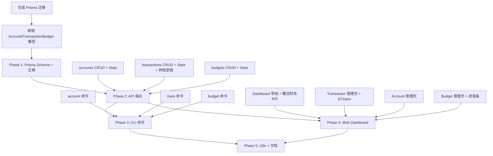

# Hum v2.0 财务管理计划

> 目标：在现有健康追踪基础上增加账户、流水、预算功能，实现经济与体重一同管理
> 日期：2026-05-29

---

## 一、设计原则

- **架构一致**：财务模块完全遵循现有健康模块的模式（Prisma → API CRUD+Stats → CLI → Dashboard → i18n）
- **Tag 分类**：不设单一 category 字段，用逗号分隔的 tags 字符串（与现有 Record 模型一致），一笔交易可打多个标签
- **纯文本标签**：标签预设只用 label 文本，不加 emoji
- **转账安全**：转账操作在事务中自动调整双方账户余额

---

## 二、数据模型

### Account（账户）

```prisma
model Account {
  id        String   @id @default(uuid())
  userId    String
  name      String              // 账户名称
  type      String              // cash/bank/credit/e-wallet
  balance   Float    @default(0)// 当前余额
  currency  String   @default("CNY")
  note      String?
  createdAt DateTime @default(now())
  updatedAt DateTime @updatedAt
  deleteAt  Int      @default(0)

  user           User          @relation(fields: [userId], references: [id], onDelete: Cascade)
  transactions   Transaction[]

  @@map("accounts")
}
```

### Transaction（流水/交易）

```prisma
model Transaction {
  id            String   @id @default(uuid())
  userId        String
  accountId     String              // 关联账户
  type          String              // income/expense/transfer
  tags          String?             // 逗号分隔标签，如 "餐饮,社交"
  amount        Float               // 金额
  fromAccountId String?             // 转账来源(type=transfer时)
  toAccountId   String?             // 转账目标(type=transfer时)
  note          String?
  attachments   String?
  date          DateTime @default(now())
  createdAt     DateTime @default(now())
  updatedAt     DateTime @updatedAt
  deleteAt      Int      @default(0)

  user      User     @relation(fields: [userId], references: [id], onDelete: Cascade)
  account   Account  @relation(fields: [accountId], references: [id])

  @@index([date])
  @@index([accountId, date])
  @@map("transactions")
}
```

### Budget（预算）

```prisma
model Budget {
  id        String   @id @default(uuid())
  userId    String
  name      String              // 预算名称
  tags      String?             // 关注的tag，如 "餐饮,外卖"；null 表示总预算
  amount    Float               // 预算金额
  period    String              // monthly/weekly/yearly
  startDate DateTime
  endDate   DateTime
  note      String?
  createdAt DateTime @default(now())
  updatedAt DateTime @updatedAt
  deleteAt  Int      @default(0)

  user      User     @relation(fields: [userId], references: [id], onDelete: Cascade)

  @@index([startDate])
  @@map("budgets")
}
```

---

## 三、Tag 预设常量

不建表，纯常量文件，Web 和 CLI 共用：

```typescript
// apps/api/lib/transaction-tags.ts
export const EXPENSE_TAGS = [
  '餐饮', '交通', '购物', '住房', '娱乐',
  '医疗', '教育', '人情', '旅行', '日用',
  '水电', '宠物', '数码', '服饰', '其他',
]

export const INCOME_TAGS = [
  '工资', '奖金', '投资', '兼职',
  '红包', '退款', '礼金', '其他',
]

export const ALL_TAGS = [...new Set([...EXPENSE_TAGS, ...INCOME_TAGS])]
```

---

## 四、API 端点

### 账户

| 方法 | 路径 | 说明 |
|------|------|------|
| GET | `/api/v1/accounts` | 账户列表 |
| POST | `/api/v1/accounts` | 创建账户 |
| GET | `/api/v1/accounts/:id` | 获取单个账户 |
| PATCH | `/api/v1/accounts/:id` | 更新账户 |
| DELETE | `/api/v1/accounts/:id` | 删除账户 |
| GET | `/api/v1/accounts/:id/transactions` | 获取账户下流水 |

### 流水

| 方法 | 路径 | 说明 |
|------|------|------|
| GET | `/api/v1/transactions` | 流水列表（支持 type/tags/accountId/date 筛选） |
| POST | `/api/v1/transactions` | 创建流水（含转账逻辑） |
| GET | `/api/v1/transactions/stats` | 流水统计 |
| GET | `/api/v1/transactions/:id` | 获取单条流水 |
| PATCH | `/api/v1/transactions/:id` | 更新流水 |
| DELETE | `/api/v1/transactions/:id` | 删除流水 |

**POST /api/v1/transactions 转账逻辑：**

```typescript
if (type === 'transfer') {
  await prisma.$transaction([
    prisma.transaction.create({ data: { type: 'transfer', ... } }),
    prisma.account.update({ where: {id: fromAccountId}, data: { balance: { decrement: amount } } }),
    prisma.account.update({ where: {id: toAccountId}, data: { balance: { increment: amount } } }),
  ])
}
```

### 预算

| 方法 | 路径 | 说明 |
|------|------|------|
| GET | `/api/v1/budgets` | 预算列表 |
| POST | `/api/v1/budgets` | 创建预算 |
| GET | `/api/v1/budgets/stats` | 预算执行统计 |
| GET | `/api/v1/budgets/:id` | 获取单个预算 |
| PATCH | `/api/v1/budgets/:id` | 更新预算 |
| DELETE | `/api/v1/budgets/:id` | 删除预算 |

---

## 五、CLI 命令

```bash
# 账户管理
hum account list                    # 列出所有账户
hum account add                     # 创建账户（交互式）
hum account update <id>             # 更新账户
hum account delete <id>             # 删除账户

# 流水/交易
hum trans list                      # 流水列表
hum trans add                       # 添加流水
hum trans update <id>               # 更新流水
hum trans delete <id>               # 删除流水
hum trans stats                     # 流水统计

# 预算管理
hum budget list                     # 预算列表
hum budget add                      # 创建预算
hum budget update <id>              # 更新预算
hum budget delete <id>              # 删除预算
hum budget stats                    # 预算执行统计
```

---

## 六、Dashboard 集成

### 导航栏扩展

在 `layout.tsx` 的导航中添加财务入口：

```
概览  体重  运动  饮食  睡眠  时间线  记录  财务  API密钥  设置
                                      └── 账户 / 流水 / 预算
```

### 概览页新增财务卡片

```
┌──────────┬──────────┬──────────┬──────────────────┐
│ ⚖️ 体重   │ 😴 睡眠   │ 🏃 运动   │ 🍽️ 饮食          │
├──────────┴──────────┴──────────┴──────────────────┤
│ 💰 财务概览（新增区域）                              │
│ ┌────────────┬────────────┬─────────────────────┐  │
│ │ 总资产       │ 本月支出     │ 预算执行             │  │
│ │ ¥12,500     │ ¥3,200     │ 餐饮 ¥2,100/¥3,000  │  │
│ └────────────┴────────────┴─────────────────────┘  │
├────────────────────────────────────────────────────┤
│ 📊 本月收支趋势图（ECharts）                         │
├────────────────────────────────────────────────────┤
│ 快捷操作（新增）                                     │
│ 💳 + 记录流水  │ 💰 + 管理预算  │ 📊 + 管理账户      │
└────────────────────────────────────────────────────┘
```

### 新增页面

| 页面 | 功能 |
|------|------|
| `/dashboard/account` | 账户管理（列表、增删改） |
| `/dashboard/transaction` | 流水管理（列表、筛选、增删改） |
| `/dashboard/budget` | 预算管理（列表、进度条、增删改） |

---

## 七、统计接口设计

### GET /api/v1/transactions/stats

```json
{
  "totalIncome": 15000,
  "totalExpense": 8200,
  "netAmount": 6800,
  "count": 35,
  "breakdownByTag": {
    "餐饮": 2500,
    "交通": 800,
    "购物": 1200,
    "娱乐": 600
  },
  "monthlyTrend": [
    { "month": "2026-05", "income": 15000, "expense": 8200 }
  ]
}
```

### GET /api/v1/budgets/stats

```json
{
  "budgets": [
    {
      "id": "...",
      "name": "餐饮预算",
      "amount": 3000,
      "spent": 2100,
      "remaining": 900,
      "progress": 70,
      "status": "normal"
    }
  ]
}
```

### GET /api/v1/accounts/net-worth（资产净值趋势）

```json
{
  "trend": [
    { "date": "2026-05-01", "netWorth": 50000 },
    { "date": "2026-05-15", "netWorth": 52000 }
  ],
  "currentNetWorth": 52500,
  "change": 2500,
  "changePercent": 5.0
}
```

---

## 八、实施顺序



| Phase | 内容 | 优先级 |
|-------|------|--------|
| 1.0 | Account + Transaction + Budget 模型 + 迁移 | 必须 |
| 1.5 | Account CRUD API | 必须 |
| 2.0 | Transaction CRUD API + 转账事务 | 必须 |
| 2.5 | Transaction Stats API（按 tag 汇总 + 月度趋势） | 必须 |
| 3.0 | Budget CRUD API | 必须 |
| 3.5 | Budget Stats API（预算执行进度） | 必须 |
| 4.0 | 资产净值趋势 API | 重要 |
| 4.5 | CLI account/trans/budget 命令 | 重要 |
| 5.0 | Dashboard 导航 + 概览财务卡片 | 重要 |
| 5.5 | Dashboard 账户/流水/预算页面 | 重要 |
| 6.0 | i18n 翻译 | 重要 |
| 6.5 | 文档更新 | 重要 |

---

## 九、涉及文件清单

| 文件 | 操作 |
|------|------|
| `apps/api/prisma/schema.prisma` | 新增 Account、Transaction、Budget 模型 |
| `apps/api/prisma/migrations/` | 自动生成迁移 |
| `apps/api/lib/transaction-tags.ts` | 新增 tag 预设常量 |
| `apps/api/app/api/v1/accounts/route.ts` | 新增 |
| `apps/api/app/api/v1/accounts/[id]/route.ts` | 新增 |
| `apps/api/app/api/v1/accounts/[id]/transactions/route.ts` | 新增 |
| `apps/api/app/api/v1/transactions/route.ts` | 新增 |
| `apps/api/app/api/v1/transactions/stats/route.ts` | 新增 |
| `apps/api/app/api/v1/transactions/[id]/route.ts` | 新增 |
| `apps/api/app/api/v1/budgets/route.ts` | 新增 |
| `apps/api/app/api/v1/budgets/stats/route.ts` | 新增 |
| `apps/api/app/api/v1/budgets/[id]/route.ts` | 新增 |
| `packages/cli/src/commands/account.js` | 新增 |
| `packages/cli/src/commands/transaction.js` | 新增 |
| `packages/cli/src/commands/budget.js` | 新增 |
| `apps/api/app/dashboard/layout.tsx` | 修改导航 |
| `apps/api/app/dashboard/page.tsx` | 新增财务概览卡片 |
| `apps/api/app/dashboard/account/` | 新增目录及页面 |
| `apps/api/app/dashboard/transaction/` | 新增目录及页面 |
| `apps/api/app/dashboard/budget/` | 新增目录及页面 |
| `apps/api/messages/zh.json` | 新增翻译 |
| `apps/api/messages/en.json` | 新增翻译 |
| `docs/api.md` | 更新文档 |
| `docs/cli.md` | 更新 CLI 文档 |
| `docs/roadmap.md` | 更新路线图 |
